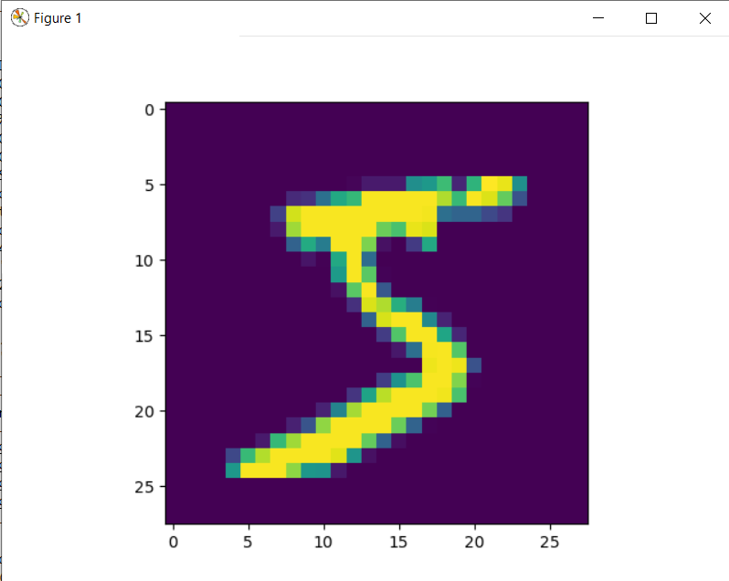
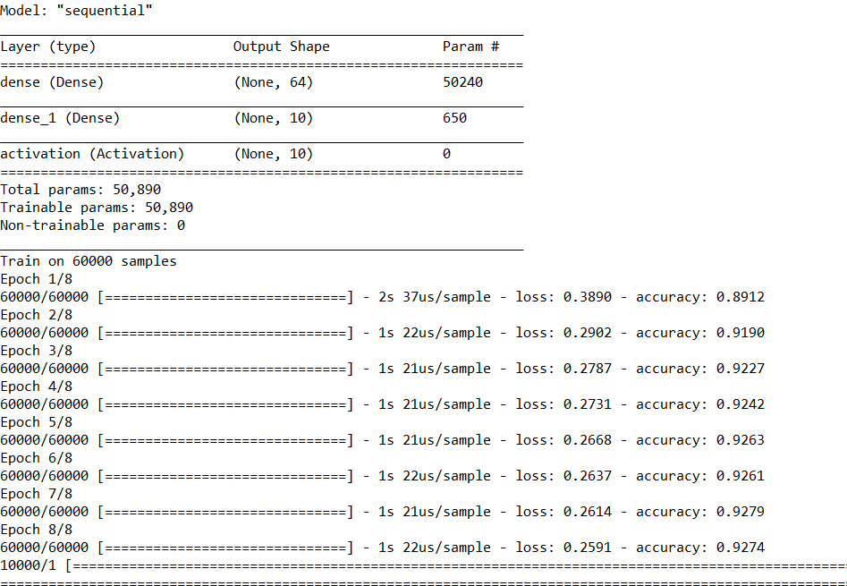
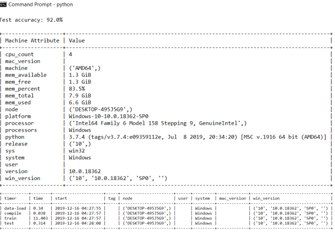
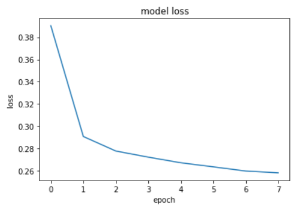
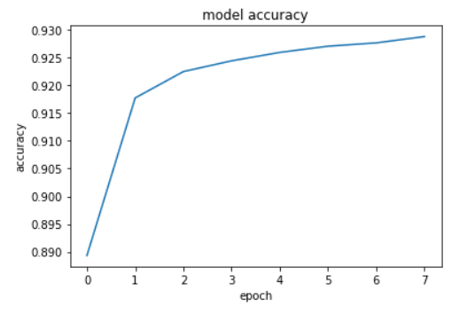

## MNIST Deep Learning Example

The MNIST database contains around 60,000 images of handwritten digits. This 
database is used as a standard for training various image processing deep 
learning systems. As a part of this project, a simple neural network with two 
dense layers and one activation layer was created. This code is saved on the 
Oracle cloud object storage. We download the file using the Oracle storage get 
command.

```bash
$ cms storage --storage=oracle get ‘big-data\mnist-deep-learning.py’ 
‘mnist-deep-learning.py’
```

To run the python file, cloudmesh-common and tensorflow is required. 
Currently, tensorflow is only supported for python version 3.7 and below.

Install cloudmesh-common using the command:

```bash
$ pip install cloudmesh-common
```

Install tensorflow using the command:

```bash
$ pip install tensorflow
```

The downloaded file is then executed using the command:

```bash
$ python 'mnist-deep-learning.py'
```

One of the hand-written digit images in the database is '5' as shown in the
 figure.
  



The model is trained on 60,000 samples. The figure shows the loss and
 accuracy for each epoch.
 



The figure shows the benchmarks for the model. 




Next, the training loss and accuracy for the model are plotted. 




