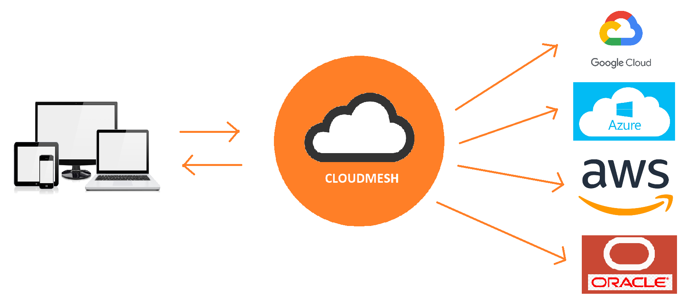

# Oracle Compute and Storage Service

* Shivani Katukota, [fa19-516-162](https://github.com/cloudmesh-community/fa19-516-162)
* Gregor von Laszewski

* Insights: 

  * <https://github.com/cloudmesh-community/fa19-516-162/graphs/contributors>
  * <https://github.com/cloudmesh/cloudmesh-oracle/graphs/contributors>

* [Example](https://github.com/cloudmesh/cloudmesh-oracle/blob/master/examples/examples.py)
* [Code](https://github.com/cloudmesh/cloudmesh-oracle)
* [Manual](https://github.com/cloudmesh/cloudmesh-manual/blob/master/docs-source/source/accounts/oracle.md)
* [Benchmark](https://github.com/cloudmesh/benchmark/blob/master/results/cloud-oracle-katukota.txt)
* Open Issues: 

    * <https://github.com/cloudmesh/cloudmesh-oracle/issues>
    * <https://github.com/cloudmesh/cloudmesh-storage/issues>

## Abstract

Cloudmesh is a multi-cloud project aimed at easy access to computing as
well as storage resources. Currently, cloudmesh integrates four cloud
service providers: AWS, Azure, Openstack and Google. The aim of this
project is to integrate Oracle cloud to cloudmesh.

### Introduction

A multi-cloud environment uses resources from multiple cloud providers.
The resources can be computing resources, storage services, database
services, or any of the several different services offered by the
vendors. A multi-cloud environment gives companies the flexibility to
use clouds for services that are better managed by them, avoids vendor
lock-in, and is more reliable in the event of a disaster. Using multiple
clouds also increases the storage capacity and computing power of the
company's network.

Cloudmesh aims to bring multiple clouds to a single platform. Via a
simple command-line tool, Cloudmesh aims to seamlessly integrate tasks
such as the creation and utilization of virtual machines from different
cloud providers. The user can switch clouds using a single variable.
Hence, he does not need to know the process of VM creation on all the
clouds.

On 16th September 2019, Oracle announced a free tier. This allows
students and professionals to build, test, and deploy applications on
the Oracle cloud and database for free for an unlimited time. The
free-tier, though, has limits for various services. Two virtual machines
and two block volumes, and 10 GB each of object and archive storage is
the current limit for free cloud tier accounts. This project aims to
integrate the Oracle cloud with Cloudmesh. This will include figuring
out the python SDK for the Oracle cloud called OCI (Oracle Cloud
Infrastructure). Using OCI, we will allow Cloudmesh to connect and use
computing as well as storage resources on the Oracle cloud.

### Advantages

* *Reliability*: There is uncertainty about a single cloud's reliability.
  Accidents happen and having down-times can significantly affect
  business. Hence, organizations are moving towards multi-cloud
  environments for a reliable network.

* *Price*: The deployments on the cloud are price-sensitive. Organizations
  are charged for what they use. If a cloud provider increases their
  prices by even a small margin, it can lead to a loss for large
  organizations that depend solely on a single cloud provider.
 
* *Data sovereignty*: It is the idea that if data is stored in a digital form, 
  then it is subjected to the laws of the country it is located in. The cloud 
  providers have their data centers in various locations across the globe. 
  Organizations are hence more comfortable with using data centers nearest to 
  their location for sensitive data. 

* *Vendor lock-in*: It is a very tedious and expensive task to switch
  between cloud providers. It is hence more advisable to use the
  multi-cloud environment as then moving data from one cloud to another
  will not take significant effort.
 
* *Specific Services*: Some cloud providers such Google provide
  specialized services for IoT and ML. Organizations that are using a
  different cloud provider but require such services will have to depend
  on different vendors.

### Current Trends

In a recent survey by Gartner, over 81% of the public cloud users said that they
are working with two or more clouds. The main reason they mentioned is to avoid 
vendor lock-in. In current times, the systems are built to be modular. It is 
straightforward for organizations to utilize different clouds for their modular 
systems. This decision also stems from the fact that organizations try to cut 
costs wherever possible and use resources that best fits their needs at the 
time. If for any reason, they would like to move to a different cloud, it should
be easy. For this reason, Gartner also predicts that by 2021, over 75% of the 
mid-size and large organizations will move to multi-cloud or hybrid cloud 
strategies.

### Cloudmesh Compute

* cloudmesh-compute project will identify Oracle's python API and 
  develop its provider.
* cloudmesh-compute project will identify how to manage credentials 
  in Oracle.
* cloudmesh-compute project will write and run pytests on Oracle cloud. 

### Cloudmesh Storage

* cloudmesh-storage project will add the feature to access storage from 
  Oracle services.
* cloudmesh-storage project will provide a REST service based on 
  OpenAPI that uses the cloudmesh API.
* cloudmesh-storage project will implement virtual directory from local.

### Lessons Learnt

* Cloud providers offer a lot of different services like computing resources 
and storage facilities for both structured and unstructured data.
* Cloud services are ideal resources to store and analyze big data.
* Learned to use the Python SDK to connect to cloud services.
* Learned to use GitHub effectively.

## Acknowledgements

We like to thank Mr. Niranda Perera for his support.

## References

1. OCI Documentation, 
<https://oracle-cloud-infrastructure-python-sdk.readthedocs.io/en/latest/index.html>
1. Required Keys and OCIDs, 
<https://docs.cloud.oracle.com/iaas/Content/API/Concepts/apisigningkey.htm>
1. Cloud Computing book, <https://laszewski.github.io/book/cloud/>
1. <https://www.gartner.com/smarterwithgartner/why-organizations-choose-a-multicloud-strategy/>
1. <https://www.gartner.com/en/conferences/apac/infrastructure-operations-cloud-india/featured-topics/cloud>
