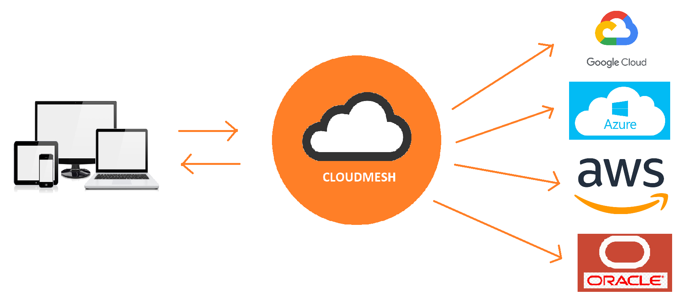

# Oracle Compute and Storage Service

Shivani Katukota, [fa19-516-162](https://github.com/cloudmesh-community/fa19-516-162)

Insights: 

* <https://github.com/cloudmesh-community/fa19-516-162/graphs/contributors>
* <https://github.com/cloudmesh/cloudmesh-oracle/graphs/contributors>

* Example: <https://github.com/cloudmesh/cloudmesh-oracle/blob/master/examples/examples.py>
* Code: <https://github.com/cloudmesh/cloudmesh-oracle>
* Manual: <https://github.com/cloudmesh/cloudmesh-manual/blob/master/docs-source/source/accounts/oracle.md>
* Benchmark: <https://github.com/cloudmesh/benchmark/blob/master/results/cloud-oracle-katukota.txt>

:o2: Project report is missing, it is mandatory to add the report taht was submitted for 534 and integrate it  int a single report.

once it is integrated it is used for review


## Abstract

Cloudmesh is a multi-cloud project aimed at easy access to computing as well as 
storage resources. Currently, cloudmesh integrates four cloud service providers: 
AWS, Azure, Openstack and Google. The aim of this project is to integrate Oracle 
cloud to cloudmesh.



### Cloudmesh Compute

* cloudmesh-compute project will identify Oracle's python API and 
  develop its provider.
* cloudmesh-compute project will identify how to manage credentials 
  in Oracle.
* cloudmesh-compute project will write and run pytests on Oracle cloud. 

### Cloudmesh Storage

* cloudmesh-storage project will add the feature to access storage from 
  Oracle services.
* cloudmesh-storage project will provide a REST service based on 
  OpenAPI that uses the cloudmesh API.
* cloudmesh-storage project will implement virtual directory from local.


## References

* OCI Documentation, 
  <https://oracle-cloud-infrastructure-python-sdk.readthedocs.io/en/latest/index.html>


## Progress

The basic functionality of both Oracle compute and storage projects
is done. There is one comment pending to check if we could download the
credentials for oracle cloud account directly and input the values in the
cloudmesh.yaml file using the command:
   
```
cms register oracle [--dir=~/.oci]
```

I haven't found a way to do this yet.
